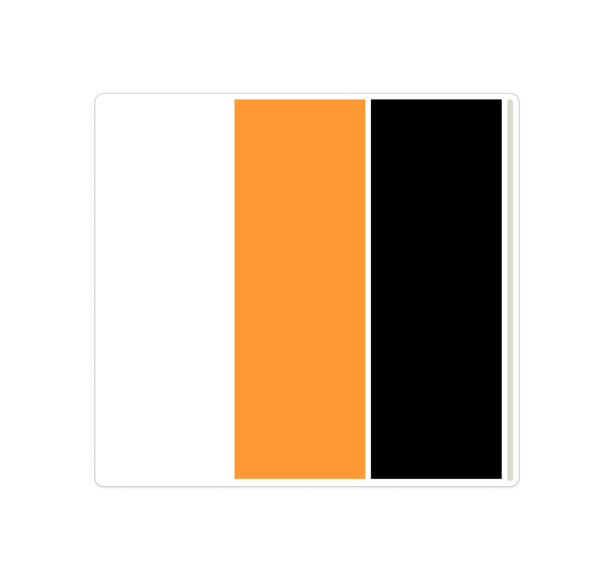
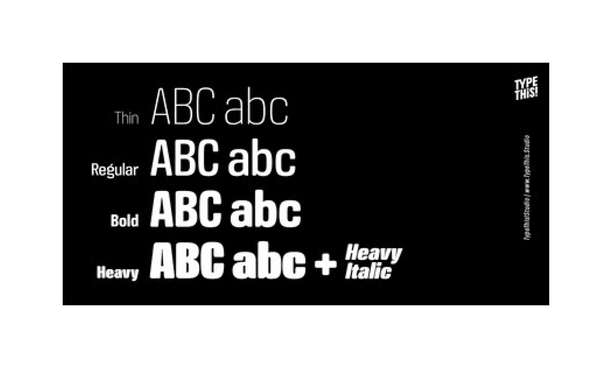
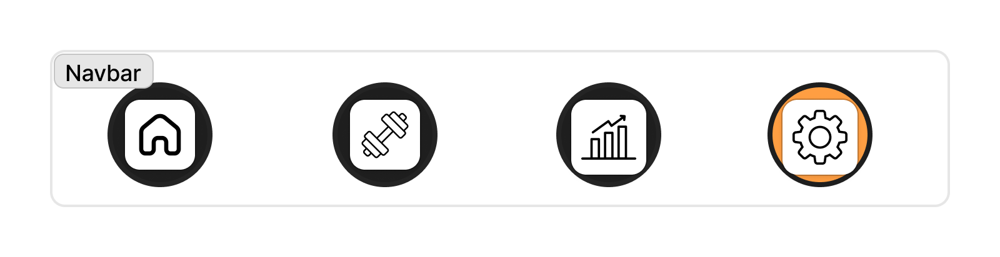

# Instructions Design

## Reference Moodboard

# Description générale 

- Inspire-toi des patterns UX d’une application comme Basic-Fit France.
- Inspire-toi des applications fitness modernes :
    - Dashboard avec statistiques en cartes
    - Navigation simple et mobile-first
    - Accent sur les KPI utilisateur
    - UX minimaliste

## Palette de couleurs

- Utiliser les couleurs definies dans le moodboard comme systeme principal de couleurs pour l'application.

- Le orange comme couleur d'accentuation des actions, le blanc pour le fond et le noir pour faire la distinctions des élements.

## Typographie

Suivre les regles typographiques definies dans le moodboard :
- Police simple

## Elements de design

- **NavBar** avec fond transparant / style liquid glass 
- **Boutons**: Rond avec fond orange pour la page actuelle et fond noir pour les boutons inactifs 
- **Icones** : Simple et intuitif de taille moyenne dans le cercle du bouton
- **Cartes**: Cartes de séances de sport collective avec des couleurs spécifiques aux cours (exemple: Zumba: Rose, Crossfit: Gris, etc à définir)

## Implementation

- Utiliser des composants React pour les éléments de design réutilisables (ex: NavBar, Bouton, Carte).
- Appliquer les styles définis dans le moodboard de manière cohérente à travers l'application.
- Assurer une expérience utilisateur fluide et intuitive, en particulier sur mobile.
